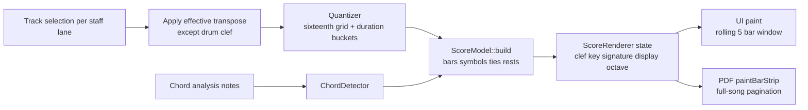
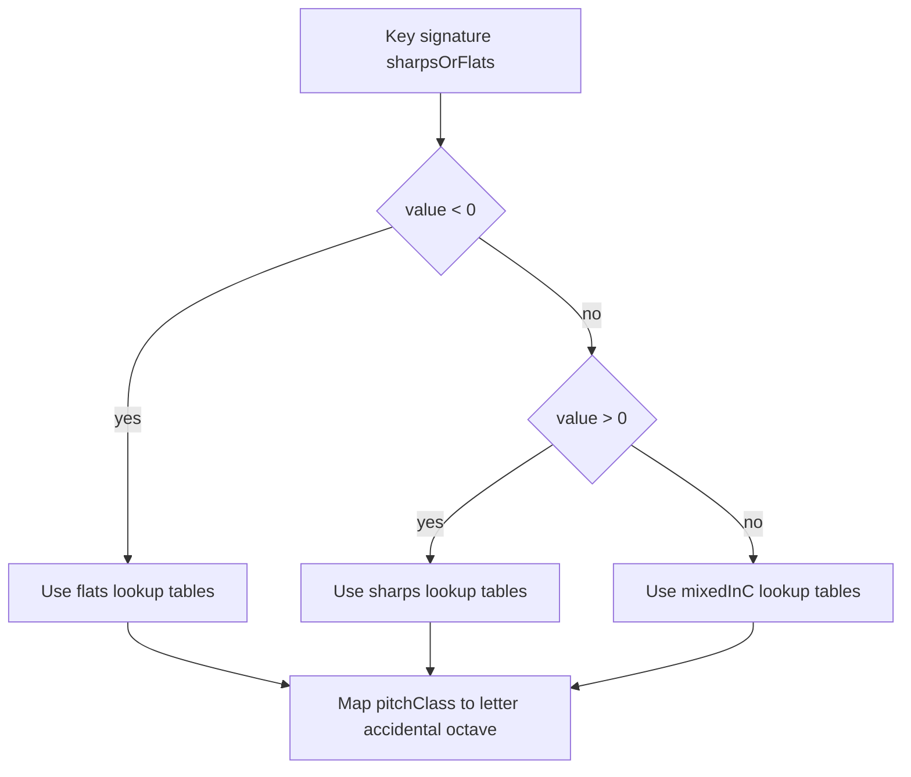
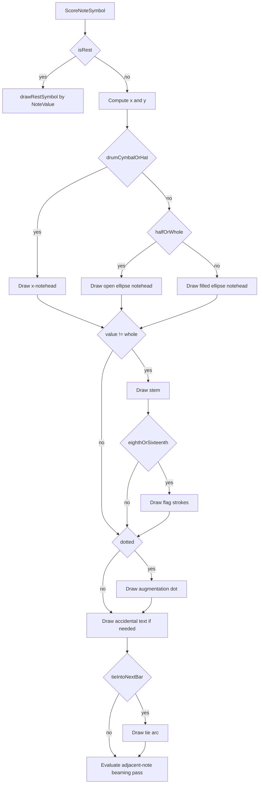
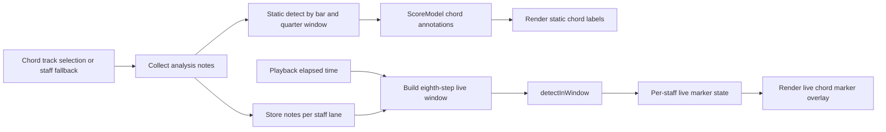
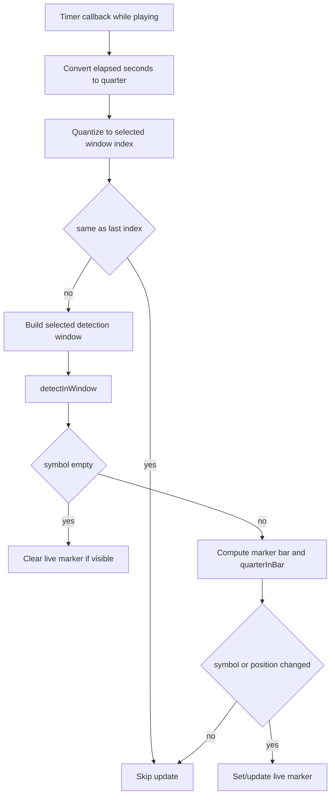

# MidiScorer Design

This document describes the internal design of MidiScorer with emphasis on:

- note scoring (notation model + rendering pipeline)
- chord detection (analysis windows, template scoring, naming)

It is intended for maintainers and contributors who need implementation-level context.

## 1) System overview

MidiScorer is a JUCE desktop app that loads a MIDI file, builds timing/key metadata, extracts notes per track, then derives two visual products:

- a score-like staff view (up to 3 staffs)
- chord annotations (static + live)

The default user workflow is non-destructive: loaded MIDI files are treated as source input, while user edits (track selection, mix controls, transpose/key/tempo overrides, loop settings, etc.) are stored and restored from profile state in `Documents/MidiScorer/ui_preset.json`.

Core modules:

- `src/midi/MidiProjectLoader.h` - MIDI ingestion, SMF type/SMPTE validation, metadata extraction
- `src/midi/TempoMap.h` - tick/quarter/second/bar conversion
- `src/midi/TrackNoteExtractor.h` - note-on/off pairing into note events
- `src/notation/Quantizer.h` - rhythmic quantization
- `src/notation/ScoreModel.h` - score-domain symbols (notes, rests, ties, chords)
- `src/notation/ScoreRenderer.h` - drawing engine for staff notation
- `src/notation/SimplePdfWriter.h` - minimal JPEG-backed PDF writing utility
- `src/harmony/ChordDetector.h` - chord-template detection and naming
- `src/app/ScorePdfExporter.h` - full-song score export pagination/orchestration
- `src/app/AppTabsHost.h` - top-level tab host (`Start`, `Score`, `Effects`)
- `src/app/MainComponent.h` - score-page orchestration, UI state, playback sync
- `src/app/PlayerTabComponent.h` - player-page MIDI output UI
- `src/app/TracksTabComponent.h` - per-track mix UI (Chan/mute/solo/volume/expression/reverb)
- `src/playback/IPlaybackPositionSource.h` - transport position abstraction
- `src/playback/MidiFilePlaybackEngineAdapter.h` - scheduled MIDI event engine adapter
- `src/playback/MidiOutputDevice.h` - single MIDI output device abstraction
- `src/playback/TrackMixState.h` - per-track mix state container
- `src/playback/TrackMixProcessor.h` - per-track playback filtering/scaling/merge
- `src/playback/TrackMixMidiSeed.h` - initialize mix from per-track channel/CC7/CC11/CC91 on load

## 2) End-to-end data flow

1. `MainComponent::loadMidiFile()` opens a JUCE file chooser and loads a MIDI file.
2. `MidiProjectLoader::load()` validates the Standard MIDI File header, then reads tracks, tempo/time signatures, key signature, and note events.
3. `TempoMap` is built and becomes the canonical timing conversion layer.
4. For each visible staff, `MainComponent::rebuildStaff()`:
   - selects source track
   - applies effective transpose (global + key override; drum exceptions)
   - quantizes notes via `Quantizer`
   - computes chord events via `ChordDetector::detect()`
   - builds score bars via `ScoreModel::build()`
5. `ScoreRenderer` paints rolling 5-bar windows centered on current playback bar.
6. `MainComponent::exportScorePdf()` can render full-song pages through `ScorePdfExporter` and persist them via `SimplePdfWriter`.
7. During playback, `timerCallback()` updates current bar/live chord markers and dispatches scheduled MIDI events to the selected output device.
8. Before dispatch, each event is filtered/scaled/remapped by track mix state (mute/solo gate, channel remap, note-on volume/expression compounding, CC7/CC11 scaling, and CC91 merge).

## 2.0) MIDI file requirements

`MidiProjectLoader` enforces ingest rules immediately after `juce::MidiFile::readFrom(..., &midiFileType)`:

- **Type 0 rejected** — SMF type **0** (single merged track) returns `false`, sets `rejectedType0`, and uses `getType0NotSupportedMessage()` so the UI can show a conversion modal. MidiScorer expects type **1** files with separate tracks per part.
- **SMPTE/non-PPQ rejected** — negative or zero PPQ time format returns an error before tempo-map construction.
- **Type 1 accepted** — normal multi-track ingest continues into tempo-map and per-track note extraction.

`MainComponent::loadMidiFile()` branches on `rejectedType0` to call `showWarningModal(...)` instead of only updating the status line.

## 2.1) Playback and output architecture

The player path is intentionally loosely coupled:

- `PlaybackController` implements `IPlaybackPositionSource` and remains the single timing authority used by score rendering and live chord windows.
- `MidiFilePlaybackEngineAdapter` loads MIDI message events from file and emits events up to a caller-provided playback time.
- `MainComponent::timerCallback()` bridges the two by passing `getElapsedSeconds()` into the adapter and routing emitted messages through `MidiOutputDevice`.
- `PlayerTabComponent` exposes MIDI output selection; playback transport lives on the Score tab.

**Tempo override policy (multi-tempo files):** override BPM is compared to the file's opening tempo and applies a uniform playback-rate scale via `PlaybackController::setTempoOverrideBpm()`. Internal tempo-change ratios in the source map are preserved; bar positions, score timing, and MIDI event scheduling remain tied to the source tempo map's song-time axis.

This keeps the scorer and player separable for future reuse in a tabbed host such as AMidiOrganOrg.

## 2.2) Per-track playback mix

Track mix is source-track based (not MIDI-channel strip based):

- `MidiFilePlaybackEngineAdapter::ScheduledEvent` carries `sourceTrackIndex`.
- `TrackMixState` holds per-track `channel`, `volume`, `expression`, `reverb`, `muted`, and `solo`.
- `TrackMixMidiSeed` initializes mix on load:
  - scans each project track sequence for the first non-meta MIDI channel (default **1**),
  - scans for the last CC7 (volume), CC11 (expression), and CC91 (reverb),
  - uses defaults **100** / **100** / **10** when a controller is absent on that track,
  - runs before preset overlay so saved values can override seeded values.
- `TrackMixProcessor` applies:
  - solo precedence (if any solo active, only solo tracks pass),
  - mute blocking when no solo is active,
  - output channel remap to the per-track **Chan** value,
  - note-on velocity compounding via `volume * expression`,
  - volume scaling for CC7 and expression scaling for CC11 controller values,
  - reverb merge for CC91: `(fileValue * trackReverb) / 127`.
- `TracksTabComponent` exposes grouped controls by track name (Chan, Mute, Solo, Volume, Expression, Reverb).
- Use **Chan** changes if you need to reorganize channels in order to play along with the score and MIDI file while playing an instrument that shares the selected MIDI module.
- `MainComponent` persists per-song mix entries in `ui_preset.json` under `trackMixBySong` keyed by normalized song path; mix control edits auto-save via `onTrackMixStateChanged()`.

## 3) Note scoring design

### 3.1 Score domain model

`ScoreModel` stores notation in score-space, not raw MIDI-space:

- `ScoreBar`
  - bar number + active time signature
  - `notes` (`ScoreNoteSymbol`)
  - `chords` (`ChordAnnotation`, bar-relative)
- `ScoreNoteSymbol`
  - absolute quarter position + `quarterInBar`
  - quantized duration (`durationQuarter`, `value`, `dotted`)
  - MIDI pitch
  - `isRest` flag
  - `tieIntoNextBar` flag

This separation allows rendering and playback sync to operate on bar-relative notation primitives.

Staff lanes also have a UI-level visibility state from the track selectors:

- `No Display` -> lane is hidden in the Score tab and skipped during PDF lane collection
- selected track -> lane is rebuilt/rendered normally

### 3.2 Quantization boundary

Quantization occurs before score construction (`Quantizer` output enters `ScoreModel::build()`).

Current rhythmic target set:

- sixteenth (0.25q), dotted sixteenth (0.375q)
- eighth (0.5q), dotted eighth (0.75q)
- quarter (1.0q), dotted quarter (1.5q)
- half (2.0q), dotted half (3.0q)
- whole (4.0q), dotted whole (6.0q)

Each duration maps to a base `NoteValue` plus an optional `dotted` flag (e.g. 3.0q -> half + dot).

This intentionally trades engraving completeness for stable readability in mixed MIDI sources.

### 3.3 Cross-bar note segmentation and ties

`ScoreModel::build()` segments a note whenever it crosses a bar boundary:

- determine active bar from `TempoMap::quarterToBar()`
- clamp segment end to next bar downbeat
- emit one symbol per segment
- set `tieIntoNextBar = true` for non-final segments

Result: sustained MIDI notes preserve continuity across bars while still fitting measure-local rendering.

### 3.4 Rest insertion (gap filling)

Rests are explicit symbols, not an implicit absence of notes.

Process per bar:

1. Collect occupied time spans from non-rest notes.
2. Merge overlapping spans.
3. Fill uncovered regions with rests using greedy longest-fit durations:
   - 6.0, 4.0, 3.0, 2.0, 1.5, 1.0, 0.75, 0.5, 0.375, 0.25 quarter notes (dotted values included)

This is handled by `insertRestsIntoBar()` + `addRestGap()`.

Outcome:

- every bar has complete rhythmic coverage
- visual rhythm remains legible even with sparse or irregular MIDI input

### 3.5 Clef, key spelling, and pitch placement

`ScoreRenderer` converts MIDI pitch into display spelling (`SpelledPitch`) and vertical position:

- spelling mode from key signature:
  - sharps
  - flats
  - mixed-in-C fallback
- accidental text derived from spelling, not raw pitch-class constants
- vertical placement uses diatonic steps for treble/bass
- drum mode uses practical percussion mapping and x-noteheads for cymbal/hat classes
- per-staff display octave shift (`-1/0/+1 octaves`) is applied at render time only

This avoids semitone-linear staff placement artifacts and improves key-aware readability.
Because octave shift is renderer-only, it does not alter MIDI playback, quantization, or chord-analysis input.

### 3.6 Rendering primitives

`ScoreRenderer::drawBar()` draws:

- bar frame, staff lines, beat guides
- first-visible-bar clef and key signature glyphs
- noteheads/stems/flags/ledger lines
  - half and whole notes use open (stroked) noteheads; quarter and shorter use filled noteheads
  - augmentation dots when `dotted=true`
- ties
- rest symbols by note value (with dots when dotted)
- top header labels (`Bar N` + track/instrument label)

The component supports light/dark color schemes with the same geometry.

### 3.7 Playback-coupled score window

The rendered window is a fixed rolling context:

- 2 bars before current
- current bar
- 2 bars after current

`setCurrentBar()` clamps to model range, preventing invalid view states near edges.

### 3.8 Full-song PDF export path

Score export reuses the existing notation stack rather than building a second renderer:

1. `MainComponent` gathers non-empty staff lanes (`ScoreModel` + `ScoreRenderer` pairs).
   - lanes marked `No Display` are excluded before pagination.
   - lane collection respects selected export mode:
     - `All active staffs` collects all non-empty lanes
     - `Staff 1 only` collects lane 1 only when non-empty
2. `ScorePdfExporter` paginates bars `1..maxBar` in fixed-size systems (`barsPerRow`).
3. For each system/lane, `ScoreRenderer::paintBarStrip(...)` draws bars with:
   - static chords enabled,
   - live chord marker disabled,
   - no playback highlight.
4. Page images are passed to `SimplePdfWriter`, which embeds JPEG page images into a valid PDF document.

This keeps export non-destructive and consistent with on-screen notation behavior.

The selected export mode is persisted in the preset payload (`pdfExportMode`) and restored on load.
Per-staff display octave selections are also persisted (`staff1DisplayOctave`, `staff2DisplayOctave`, `staff3DisplayOctave`) and reflected in PDF output because export uses the live `ScoreRenderer` state.

### 3.9 Staff notation engine deep dive (pseudo-code level)

This subsection reverse-engineers the concrete notation pipeline from the code in:

- `src/app/ScoreRebuildService.h`
- `src/notation/Quantizer.h`
- `src/notation/ScoreModel.h`
- `src/notation/ScoreRenderer.h`

Notation pipeline overview:



#### 3.9.1 Rebuild pipeline per staff lane

Each staff lane runs an explicit rebuild path that keeps notation state deterministic and independent from playback output-device behavior.

Pseudo-code:

```cpp
for lane in [staff1, staff2, staff3]:
    idx = lane.trackSelector.selectedItemIndex
    if idx invalid:
        clearStaff(lane.model, lane.renderer)
        liveChordNotesByStaff[lane].clear()
        continue

    track = project.tracks[idx]
    notes = copy(track.notes)
    clef = clefTypeFromCombo(lane.clefSelector) // treble | bass | drum

    // Transpose for notation/chord-analysis context, but never for drum clef
    semitones = effectiveTransposeForTrack(idx)
    if semitones != 0 and clef != drum:
        for n in notes:
            n.noteNumber = clamp(0, 127, n.noteNumber + semitones)

    quantized = Quantizer::quantizeTrack(notes, tempoMap)
    chordNotes = collectChordAnalysisNotes(idx) // or shared notes path
    chords = ChordDetector::detect(chordNotes, tempoMap, maxBar, namingOptions)

    lane.model.build(tempoMap, quantized, chords, maxBar)
    lane.renderer.setStaffLabel(track.name)
    lane.renderer.setClefType(clef)
    lane.renderer.setCurrentBar(playbackController.currentBar)
```

Design implications:

- Staff model content is regenerated from source track notes on every relevant UI change.
- Clef choice affects both pitch mapping and transpose eligibility.
- Chord annotations are stored in bar space and rendered separately from live playback markers.

#### 3.9.2 Quantization algorithm and note-value classification

`Quantizer` works in quarter-note units and targets a fixed rhythmic vocabulary.

Pseudo-code:

```cpp
for midiNoteEvent in trackNotes:
    rawStartQ = tempoMap.tickToQuarter(startTick)
    rawEndQ = tempoMap.tickToQuarter(endTick)
    rawDurQ = max(0, rawEndQ - rawStartQ)

    q.startQuarter = round(rawStartQ / 0.25) * 0.25
    q.durationQuarter = nearest(rawDurQ, dotted + undotted vocabulary)
    symbol = durationFromQuarter(q.durationQuarter)
    q.value = symbol.value
    q.dotted = symbol.dotted
```

`durationFromQuarter` picks the closest duration from:

- undotted: 0.25, 0.5, 1.0, 2.0, 4.0
- dotted: 0.375, 0.75, 1.5, 3.0, 6.0

Examples:

- 3.0q -> half + dot
- 1.5q -> quarter + dot
- 2.0q -> half (no dot)

This is intentionally not full engraving quantization (tuplets/double dots/voice splitting); it favors stable readability for arbitrary MIDI.

#### 3.9.3 Bar segmentation, ties, and normalization

`ScoreModel::build` first allocates bars `1..maxBarHint`, then writes symbols into bar-local time.

Pseudo-code:

```cpp
for q in quantizedNotes:
    noteStart = max(0, q.startQuarter)
    noteEnd = max(noteStart, q.startQuarter + q.durationQuarter)
    segmentStart = noteStart

    while segmentStart < noteEnd:
        bar = tempoMap.quarterToBar(segmentStart)
        barStart = tempoMap.barToQuarterDownbeat(bar)
        nextBarStart = tempoMap.barToQuarterDownbeat(bar + 1)
        segmentEnd = min(noteEnd, nextBarStart)

        emit ScoreNoteSymbol {
            barNumber = bar
            quarter = segmentStart
            quarterInBar = max(0, segmentStart - barStart)
            durationQuarter = segmentEnd - segmentStart
            midiNote = q.midiNote
            value = quarterToNoteValue(durationQuarter)
            tieIntoNextBar = (segmentEnd < noteEnd)
        }

        segmentStart = segmentEnd
```

Chord event normalization:

```cpp
normalized.quarter = max(0, chord.quarter - barDownbeatQuarter(bar))
bar.chords.push_back(normalized)
```

Result: long notes crossing measure boundaries are represented as chained bar-local symbols with explicit tie metadata.

#### 3.9.4 Rest gap-filling strategy

Rests are synthesized so each bar has complete rhythmic coverage.

Pseudo-code:

```cpp
occupied = intervals of non-rest notes in [0, barDuration]
merged = mergeOverlaps(occupied)
cursor = 0
for span in merged:
    if span.start > cursor:
        addRestGap(cursor, span.start - cursor) // greedy: 6,4,3,2,1.5,1,0.75,0.5,0.375,0.25
    cursor = max(cursor, span.end)

if cursor < barDuration:
    addRestGap(cursor, barDuration - cursor)
```

`addRestGap` emits one or more `isRest=true` symbols with note values chosen by longest-fit decomposition.

#### 3.9.5 Pitch spelling and accidental rendering

For treble/bass staffs, note spelling is computed from pitch class plus a key-signature-aware mode:

- `sharps` mode
- `flats` mode
- `mixedInC` fallback when no key signature

Pitch spelling mode selection:



Pseudo-code:

```cpp
mode =
    keySharpsOrFlats < 0 ? flats :
    keySharpsOrFlats > 0 ? sharps :
    mixedInC

pc = midiNote % 12
letter, accidental = lookupTable[mode][pc]
```

Accidental glyph policy:

- drum clef -> no accidental glyph
- accidental `-1` -> `"b"`
- accidental `+1` -> `"#"`
- accidental `0` -> no accidental text

#### 3.9.6 Vertical placement model

Treble/bass placement is diatonic, not semitone-linear:

```cpp
spelled = spellMidiPitch(note)
diatonicIndex = spelled.octave * 7 + spelled.letter
reference = (clef == bass) ? D3_middle_line : B4_middle_line
y = centerY - (diatonicIndex - reference) * 5.5f
```

Ledger lines are drawn if the notehead lies outside the five-line staff bounds.

Drum clef placement uses explicit GM-oriented buckets (kick/snare/toms/hats/cymbals) plus a bounded fallback mapping.

#### 3.9.7 Glyph construction rules in `drawBar`

Render-time glyph decision flow:



For each symbol in bar order:

- rest symbol -> draw rest path/rect by `NoteValue`; draw augmentation dot when `dotted`
- pitched note:
  - compute x from `quarterInBar`
  - compute y from clef/pitch mapping
  - draw notehead (open ellipse for half/whole, filled for shorter, or x-notehead for cymbal/hat drums)
  - draw stem unless whole note
  - draw flags for eighth/sixteenth
  - draw augmentation dot when `dotted`
  - draw accidental text (if any)
  - draw tie arc when `tieIntoNextBar=true`

Simple beaming is added for adjacent short notes when:

- both notes are eighth/sixteenth
- neither is rest
- horizontal spacing threshold is satisfied (`quarterInBar` delta <= `0.75`)

#### 3.9.8 Display octave shift semantics

Per-staff display octave shift is renderer-only state (`-1, 0, +1` octaves):

```cpp
displayMidi = isDrumClef ? rawMidi : clamp(0,127, rawMidi + shift * 12)
```

This transformed display pitch is used by drawing paths (y position, accidental choice, drum x-notehead classification), but does not mutate:

- source MIDI track notes
- quantizer output
- score model storage
- playback/output pitch behavior

Because PDF export calls `ScoreRenderer::paintBarStrip(...)`, exported notation matches the same display-octave presentation (WYSIWYG).

## 4) Chord detection design

### 4.1 Input selection

Chord analysis does not rely on a single displayed staff track.

`MainComponent` builds a merged note set from selected "Chord Tracks" checkboxes:

- track list is filtered to tracks that contain note events or non-meta MIDI events
- checkbox selections map back to original track indices
- merged note list is optionally transposed using effective transpose
- GM percussion channel (10) is excluded from transpose

### 4.2 Static chord annotation pass

`ChordDetector::detect()` scans by bars and resolution-selected windows:

- for each bar in `[1..maxBar]`
- for each detection window in bar (`1.0q` quarter or `0.5q` eighth)
- call `detectWindow(notes, secA, secB, options)`

Dedup behavior:

- annotations emitted only when symbol changes
- `previousSymbol` resets per bar and on silence windows

This produces stable, non-redundant chord markers in score space.

### 4.3 Live chord detection pass

During playback (`timerCallback()`):

- recompute at the selected chord-grid boundary
- detect with the same window size used by static chord labels (`1.0q` quarter or `0.5q` eighth)
- update marker only when symbol or marker position changes
- clear marker on empty windows

Live markers are tracked per staff (`liveChordStates`) and rendered separately from static bar labels.

### 4.4 Window extraction

`detectWindow()`:

- includes notes whose time intervals overlap the query window
- extracts pitch-class set (`pcs`)
- tracks bass (minimum MIDI note) and highest note

Minimum threshold:

- fewer than 3 pitch classes -> no chord result

### 4.5 Template matching and scoring

Chord templates are defined as:

- `suffix`
- required intervals
- optional intervals

Detection loops over all 12 roots and all templates:

- skip if required intervals missing
- score each observed pitch class:
  - +5 required
  - +2 optional
  - -1 other
- add context bonuses:
  - +2 if bass pitch-class equals root
  - +1 if highest note equals perfect fifth of root

Best score wins.

This deterministic scorer is simple, explainable, and fast enough for realtime updates.

Complexity whitelist gating is applied before scoring:

- `Simple`: `""`, `m`, `dim`, `aug`, `sus2`, `sus4`
- `Standard`: `Simple` + `6`, `m6`, `7`, `maj7`, `m7`, `mMaj7`, `add9`, `9`, `m9`, `11`, `13`
- `Rich`: `Standard` + `7b5`, `7#5`, `7b9`, `7#9`

### 4.6 Naming and display style

Root/bass spelling controlled by `NamingOptions`:

- `preferSharps` or `preferFlats`
- `plain` or `jazzSymbols` suffix style
- `simple` / `standard` / `rich` chord complexity filtering

Slash chord output is emitted when bass pitch-class differs from root.

Examples:

- `Cmaj7`
- `Ebm7`
- `G7/B`

### 4.7 Ready-to-paste complexity whitelist

JSON:

```json
{
  "simple": ["", "m", "dim", "aug", "sus2", "sus4"],
  "standard": ["", "m", "dim", "aug", "sus2", "sus4", "6", "m6", "7", "maj7", "m7", "mMaj7", "add9", "9", "m9", "11", "13"],
  "rich": ["", "m", "dim", "aug", "sus2", "sus4", "6", "m6", "7", "maj7", "m7", "mMaj7", "add9", "9", "m9", "11", "13", "7b5", "7#5", "7b9", "7#9"]
}
```

C++:

```cpp
constexpr std::array<const char*, 6> kSimpleSuffixes = {
    "", "m", "dim", "aug", "sus2", "sus4"
};

constexpr std::array<const char*, 17> kStandardSuffixes = {
    "", "m", "dim", "aug", "sus2", "sus4", "6", "m6", "7", "maj7", "m7", "mMaj7", "add9", "9", "m9", "11", "13"
};

constexpr std::array<const char*, 21> kRichSuffixes = {
    "", "m", "dim", "aug", "sus2", "sus4", "6", "m6", "7", "maj7", "m7", "mMaj7", "add9", "9", "m9", "11", "13", "7b5", "7#5", "7b9", "7#9"
};
```

### 4.8 Chord recognition deep dive (pseudo-code level)

This subsection documents the concrete detection and runtime integration behavior from:

- `src/harmony/ChordDetector.h`
- `src/app/ScoreRebuildService.h`
- `src/app/MainComponent.h` (`timerCallback` live marker path)

#### 4.8.1 End-to-end architecture

Chord recognition runs in two related pipelines:

1. static annotation generation during staff rebuild (`detect`)
2. live playback marker updates during transport (`detectInWindow`)

Chord architecture overview:



#### 4.8.2 Input note-set construction

`MainComponent` builds chord-analysis notes from selected chord tracks, with optional staff-track fallback when no chord tracks are selected.

Pseudo-code:

```cpp
if selectedChordTracks not empty:
    selectedIndices = selected chord-track source indices
else if allowStaffFallback and selectedStaffTrackIndex valid:
    selectedIndices = [selectedStaffTrackIndex]
else:
    selectedIndices = []

mergedNotes = concat(project.tracks[idx].notes for idx in selectedIndices)

transpose = globalTranspose + keyOverrideDelta
for n in mergedNotes:
    if n.channel != 10: // preserve GM percussion
        n.noteNumber = clamp(0, 127, n.noteNumber + transpose)
```

Notes are collected twice by design:

- static rebuild path for bar annotations
- playback path for low-latency live marker refresh

#### 4.8.3 Static detection scan (`detect`)

Static detection iterates bar-by-bar, then quarter-window-by-quarter-window.

Pseudo-code:

```cpp
out = []
for bar in 1..maxBar:
    previousSymbol = ""
    barStartQ = map.barToQuarterDownbeat(bar)
    nextBarQ = map.barToQuarterDownbeat(bar + 1)

    for q in [barStartQ, barStartQ+1, ..., < nextBarQ]:
        secA = map.tickToSeconds(map.quarterToTick(q))
        secB = map.tickToSeconds(map.quarterToTick(q + 1))
        symbol = detectWindow(notes, secA, secB, options)

        if symbol empty:
            previousSymbol = ""
            continue

        if symbol != previousSymbol:
            out.push({ barNumber: bar, quarter: q, symbol: symbol })
            previousSymbol = symbol
```

Dedup rules intentionally reset at:

- new bar boundary
- silence windows (empty symbol)

This allows the same symbol to reappear after rhythmic gaps.

#### 4.8.4 Window extraction and feature set

`detectWindow` constructs a compact harmonic feature set from notes overlapping `[startSec, endSec)`:

- `pcs`: distinct pitch classes (`0..11`)
- `bass`: minimum MIDI note number in window
- `highest`: maximum MIDI note number in window

Guard condition:

- if unique pitch classes `< 3`, return no chord

Pseudo-code:

```cpp
pcs = set()
bass = -1
highest = -1
for n in notes:
    if overlaps(n.time, [startSec, endSec)):
        pcs.add(n.noteNumber mod 12)
        bass = minOrInit(bass, n.noteNumber)
        highest = maxOrInit(highest, n.noteNumber)

if pcs.size < 3:
    return ""
```

#### 4.8.5 Template matcher and scorer

For each candidate root `0..11` and each chord template:

1. required intervals must all be present
2. score observed pitch classes against required/optional sets
3. apply musical-context bonuses
4. keep highest-scoring candidate

Scoring terms:

- `+5` per observed required interval
- `+2` per observed optional interval
- `-1` per observed non-template interval
- `+2` if bass pitch class equals root
- `+1` if highest pitch class equals perfect fifth above root

Pseudo-code:

```cpp
bestScore = -inf
bestSymbol = ""
for root in 0..11:
    for tmpl in templates:
        if any required interval missing:
            continue

        score = 0
        for pc in pcs:
            rel = (pc - root) mod 12
            score += 5 if rel in required
            score += 2 if rel in optional
            score -= 1 otherwise

        if bassPc == root: score += 2
        if highestPc == (root + 7) mod 12: score += 1

        if score > bestScore:
            bestScore = score
            bestSymbol = formatRootAndSuffix(root, tmpl, options)
            if bassPc valid and bassPc != root:
                bestSymbol += "/" + pitchName(bassPc, options.accidentalPreference)
```

Template catalog includes triads, suspended, 6/m6, sevenths, major/minor sevenths, altered sevenths (`7b5`, `7#5`, `7b9`, `7#9`), extensions (`9`, `11`, `13`), and `add9`.

Template interval matrix (relative semitone offsets from candidate root):

| Suffix | Required intervals | Optional intervals |
|---|---|---|
| `""` | `[0, 4, 7]` | `[2, 9, 11]` |
| `"m"` | `[0, 3, 7]` | `[2, 10]` |
| `"dim"` | `[0, 3, 6]` | `[9]` |
| `"aug"` | `[0, 4, 8]` | `[10]` |
| `"sus2"` | `[0, 2, 7]` | `[10]` |
| `"sus4"` | `[0, 5, 7]` | `[10]` |
| `"6"` | `[0, 4, 7, 9]` | `[2]` |
| `"m6"` | `[0, 3, 7, 9]` | `[2]` |
| `"7"` | `[0, 4, 7, 10]` | `[2, 5, 9]` |
| `"maj7"` | `[0, 4, 7, 11]` | `[2, 9]` |
| `"m7"` | `[0, 3, 7, 10]` | `[2, 5]` |
| `"mMaj7"` | `[0, 3, 7, 11]` | `[2]` |
| `"7b5"` | `[0, 4, 6, 10]` | `[2]` |
| `"7#5"` | `[0, 4, 8, 10]` | `[2]` |
| `"9"` | `[0, 4, 7, 10, 2]` | `[5, 9]` |
| `"m9"` | `[0, 3, 7, 10, 2]` | `[5]` |
| `"11"` | `[0, 4, 7, 10, 5]` | `[2]` |
| `"13"` | `[0, 4, 7, 10, 9]` | `[2, 5]` |
| `"7b9"` | `[0, 4, 7, 10, 1]` | `[8]` |
| `"7#9"` | `[0, 4, 7, 10, 3]` | `[8]` |
| `"add9"` | `[0, 4, 7, 2]` | `[9, 11]` |

#### 4.8.6 Naming transform layer

Root and slash-bass pitch names are formatted by accidental preference:

- `preferSharps` -> `C#`, `F#`, `A#`
- `preferFlats` -> `Db`, `Gb`, `Bb`

Suffix post-processing for jazz symbols:

- `maj7` -> `^7`
- `mMaj7` -> `m^7`
- `m` -> `-`
- `m7` -> `-7`

All other suffixes pass through unchanged.

#### 4.8.7 Live detection path and marker-state machine

Live markers and static labels now share one user-selected grid:

- `Quarter` mode (default): `windowQ = 1.0`
- `Eighth` mode: `windowQ = 0.5`

Pseudo-code:

```cpp
windowQ = windowQuarterLength(selectedResolution)
windowIndex = floor(currentQuarter / windowQ)
windowQStart = windowIndex * windowQ
windowQEnd = windowQStart + windowQ
symbol = detectInWindow(liveChordNotesByStaff[staff], sec(windowQStart), sec(windowQEnd), namingOptions)

if symbol empty:
    clear marker if previously shown
else:
    markerBar = quarterToBar(windowQStart)
    markerQuarterInBar = windowQStart - barDownbeatQuarter(markerBar)
    if symbol changed OR marker position moved:
        update marker
```

Marker update suppression avoids redundant UI repaints when symbol and position are unchanged.

Live marker flow:



#### 4.8.8 Complexity and performance posture

Let:

- `N` = notes overlapping a queried window candidate pass
- `R` = 12 roots
- `T` = template count
- `B` = bars
- `Q` = windows per bar (`4` in quarter mode, `8` in eighth mode)

Then:

- `detectWindow` is roughly `O(N + R*T*|pcs|)` with small bounded `|pcs| <= 12`
- static detect is `O(B * Q * detectWindow)`
- live detect is amortized by eighth-index gate and "changed-only" marker update

Additional optimization already present:

- When chord-track selection is active, shared static chord detection is computed once per rebuild and reused across staff lanes (`ScoreRebuildService` shared-chords path).

## 5) Key and transpose interactions

Effective transpose used by notation/chord analysis:

- `effective = globalTranspose + (assignEnabled ? 0 : keyOverrideAppliedSemitones)`

where key override applied semitones accumulate per key change:

- each key change (with **Assign** unchecked) adds the shortest-path semitone delta from the previous key center to the new override key
- on preset load, applied semitones initialize from `(override tonic - MIDI tonic)` when a key override is present
- returning to a prior key (e.g. C -> F -> C) returns applied semitones to zero because deltas accumulate from source MIDI, not from the current displayed pitch

Important:

- detected MIDI key uses major/minor conversion compatible with the tonic lookup helper
- when **Assign** is enabled, key text is preserved for profile/reference but contributes `0` semitones
- **Assign** is session-only and is not stored in `ui_preset.json`
- drum clef and channel-10 percussion remain untransposed

## 5.1) Score status line

`MainComponent::refreshStatusMessage()` composes the Score tab status label as:

`Sig | Bar | {playback/status message} | Tempo | KeySrc`

- **Sig** — time signature from tempo map (first signature event)
- **Bar** — current bar / max bar
- **Tempo** — detected BPM, with override text when tempo override is active
- **KeySrc** — whether key text source is **detected** (MIDI key signature) or **override** (Key field); transpose application is additionally gated by **Assign**

Playback messages include `Playback running`, `Playback stopped`, `Playback continuing from bar N`, and `Playback finished.`

## 6) Design constraints and trade-offs

- Single-voice approximation per staff (not full polyphonic engraving)
- Quantization limited to five note values
- Chord detection is template-based (not probabilistic/hierarchical)
- Realtime behavior prioritized over exhaustive harmonic interpretation

These constraints keep behavior predictable and maintainable for mixed-quality MIDI sources.

## 7) Extension points

Likely future improvements:

- richer rhythmic values (triplets, double dots)
- voice separation for dense piano tracks
- stronger chord context model (inversion weighting, temporal smoothing)
- configurable chord detection window sizes
- richer tie/rest engraving rules
- per-track output routing (currently out of scope by design)

## 8) Validation strategy

Current verification layers:

- unit tests in `tests/test_main.cpp` for timing/chord/model regressions
- rebuild + playback smoke tests for UI/render sync
- fixture-based MIDI scenarios for edge cases (cross-bar notes, silence resets, SMPTE rejection, orphan note-ons)

For changes touching scoring or harmony logic, re-run both tests and manual playback checks.
