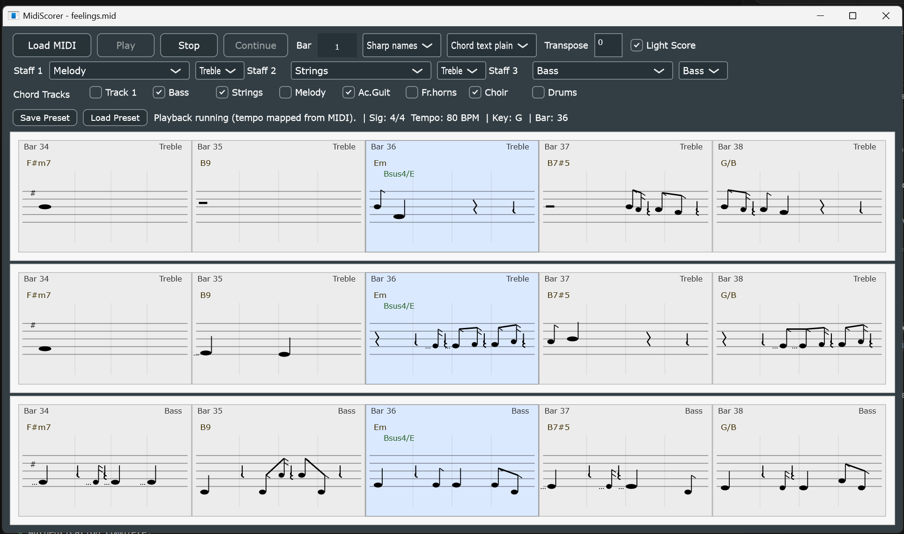

# MidiScorer

MidiScorer is a JUCE/C++ standalone desktop app that reads MIDI files, renders up to three selected tracks as score-like notation, detects chords, follows playback with a rolling 5-bar view, and can emit MIDI playback to a selected external MIDI output device.



## Current capabilities

- Load `.mid` / `.midi` files.
- Auto-load last saved UI preset when a MIDI file is loaded (if present).
- Display up to three independent staffs:
  - per-staff track selection
  - per-staff clef selection (`Treble` / `Bass` / `Drum`)
- Build tempo, time-signature, and key-signature maps from MIDI meta events.
- Quantize note starts and durations to:
  - 1/16, 1/8, 1/4, 1/2, whole
- Render score-style notation with:
  - noteheads, stems, flags, ties
  - key-aware accidental display (`#`/`b` preference by key signature)
  - first-visible-bar start symbols:
    - enlarged clef glyphs (treble/bass)
    - enlarged key-signature glyphs (up to 7 sharps/flats)
  - per-measure top-right staff header text shows selected track/instrument name
  - drum clef mode uses percussion-oriented note placement and x-noteheads for hat/cymbal hits
  - explicit rest symbols (gaps are modeled and rendered as rests)
- Detect/display chords:
  - static bar chord label (left-aligned)
  - live chord marker recomputed on 1/8-note boundaries, shown only when chord changes
- Chord source selection:
  - dynamic per-track checkbox list (`Chord Tracks`) used for harmonic analysis
- Playback controls:
  - `Play`, `Stop`, `Continue`, and bar start input
  - on `Stop`, continue bar auto-fills with current bar
- Tabbed workspace (tab order: **Start**, **Score**, **Effects**):
  - `Start` tab for MIDI output device selection (transport controls are on the Score tab)
  - `Score` tab for notation/chord controls and renderers
  - `Effects` tab for per-track mix controls
- MIDI player and output:
  - MIDI file playback events are scheduled from file time and dispatched on the same transport timeline that drives live score/chord updates
  - single selected MIDI output device (GM-oriented output path)
  - persisted selected output device identifier under `Documents/MidiScorer/midi_output.json`
- Per-track playback mix:
  - per eligible MIDI track controls for **Mute**, **Solo**, **Volume**, and **Reverb** (0..127)
  - on load, volume/reverb seed from the track's last **CC7** / **CC91** when present; otherwise defaults are **100** / **10**
  - saved per-song mix in `ui_preset.json` (`trackMixBySong`) overrides MIDI-seeded values after edit/save
  - grouped controls by track name in the `Effects` tab (AMidiOrgan-style slider colors)
  - volume scales note-on velocity and CC7/CC11 during playback; reverb merges CC91 during playback
- Per-song score overrides (stored in `Documents/MidiScorer/ui_preset.json`):
  - transpose per song under `transposeOverridesBySong`
  - key override per song under `keyOverridesBySong`
  - tempo override per song under `tempoOverridesBySong`
  - staff/chord-track/accidental/alias selections and other score UI state per song
- Display options:
  - `Light Score` / dark score toggle (Light Score is default)
  - status line order: **Sig**, **Bar**, playback message, **Tempo**, **KeySrc**
  - `Save Preset` turns red when score song settings are dirty; returns to default after save/load
- Score tab UI layout (row summary):
  - row 1: Load MIDI, Start/Stop, Continue, Bar, accidental/alias, Light Score, Save/Load Preset
  - row 2: staff track/clef selectors
  - row 3: Chord Tracks checkboxes
  - row 4: Tempo, Key, Transpose, status line
- Window title includes loaded MIDI filename.

## Project structure

- `CMakeLists.txt` - JUCE/CMake project setup
- `Main.cpp` - JUCE application entry point
- `src/app/AppTabsHost.h` - top-level tab container (`Start` + `Score` + `Effects`)
- `src/app/MainComponent.h` - score page UI controls, notation orchestration, playback sync
- `src/app/PlayerTabComponent.h` - player page MIDI output selection
- `src/app/TracksTabComponent.h` - Effects tab (per-track Mute/Solo/Volume/Reverb)
- `src/midi/TempoMap.h` - tempo/time-signature/bar conversion
- `src/midi/TrackNoteExtractor.h` - note-on/note-off pairing
- `src/midi/MidiProjectLoader.h` - MIDI ingestion and metadata extraction
- `src/notation/Quantizer.h` - rhythmic quantization
- `src/notation/ScoreModel.h` - score bars/notes/chords/rest insertion
- `src/notation/ScoreRenderer.h` - score drawing and live chord marker rendering
- `src/harmony/ChordDetector.h` - chord analysis and naming options
- `src/playback/PlaybackClock.h` - playback timing core
- `src/playback/PlaybackController.h` - playback state/current bar implementing position-source interface
- `src/playback/IPlaybackPositionSource.h` - transport position abstraction boundary
- `src/playback/MidiFilePlaybackEngineAdapter.h` - scheduled MIDI-event playback adapter
- `src/playback/MidiOutputDevice.h` - single-output MIDI device abstraction
- `src/playback/TrackMixState.h` - per-track volume/reverb/mute/solo state
- `src/playback/TrackMixProcessor.h` - playback gating and per-track message scaling/merge
- `src/playback/TrackMixMidiSeed.h` - seed mix sliders from track CC7/CC91 on load
- `tests/test_main.cpp` - core tests
- `tests/fixtures/` - fixture specs/documentation

## Requirements

- CMake 3.22+
- C++17 compiler
- JUCE source checkout available in one of:
  - `-DJUCE_ROOT=<path-to-JUCE>`
  - `.deps/JUCE` under this project
  - `C:/JUCE` (Windows auto-detected)

## Build (Windows example)

```powershell
cmake -S . -B build -DJUCE_ROOT="C:/JUCE"
cmake --build build --config Debug --target MidiScorer
```

Output executable:

- `build/MidiScorer_artefacts/Debug/MidiScorer.exe`

## Run tests

```powershell
cmake --build build --config Debug --target MidiScorerTests
ctest --test-dir build -C Debug --output-on-failure
```

## How to use

1. Launch `MidiScorer`.
2. Click **Load MIDI** and choose a MIDI file.
3. Optionally let auto-preset apply, or use **Load Preset** manually.
4. Configure Staff 1/2/3 track and clef.
   - use `Drum` clef for percussion tracks
5. Choose harmonic source tracks using **Chord Tracks** checkboxes.
6. Optionally adjust:
   - transpose
   - key override
   - chord naming options
   - score color mode
7. Use **Score** tab to view/edit notation options and track assignments.
8. Use **Start** tab to select a MIDI output device.
9. Use **Score** tab **Start/Stop**, **Continue**, and **Bar** for playback transport.
10. Use **Effects** tab to adjust per-track Mute, Solo, Volume, and Reverb.

## Notes and known limitations

- Rendering is intentionally simplified (single-voice approximation per staff).
- Quantization is limited to 1/16 through whole-note values.
- Rests, beaming, and accidental handling are practical approximations, not full engraving rules.
- Chord detection uses deterministic template scoring and may be ambiguous for dense voicings.
- Playback drives visual sync and optional MIDI output from one shared timeline.
- Output is intentionally limited to a single GM-oriented MIDI destination.
- Track mix controls apply per source MIDI track:
  - volume scales note-on velocity and CC7/CC11
  - reverb merges CC91 when present in the file
  - slider UI values seed from last CC7/CC91 per track (defaults 100/10) unless overridden by saved preset

## Developer notes

- `MIDI ingest pipeline`
  - Entry point is `MidiProjectLoader::load()` in `src/midi/MidiProjectLoader.h`.
- `Tempo/bar math`
  - `src/midi/TempoMap.h` is the authoritative timing layer.
- `Chord detection`
  - `src/harmony/ChordDetector.h` contains template matching and naming rules.
  - `detectInWindow(...)` supports live playback window detection.
- `Notation model`
  - `src/notation/ScoreModel.h` inserts explicit rest symbols per bar by gap-filling occupied note spans.
- `Notation rendering`
  - `src/notation/ScoreRenderer.h` handles static chord labels, live chord marker, notes/rests, per-staff instrument header labels, first-visible-bar clef/key symbols, and drum-mode note rendering.
- `UI orchestration`
  - `src/app/MainComponent.h` coordinates all preferences, preset load/save, multi-staff rebuilds, and timer-based updates.

## First contribution checklist

1. Configure/build locally.
2. Run `ctest` and ensure zero failures.
3. Smoke test:
   - load MIDI
   - verify staff selectors and chord track checkboxes
   - verify Play/Stop/Continue behavior
   - verify live chord marker updates on playback
